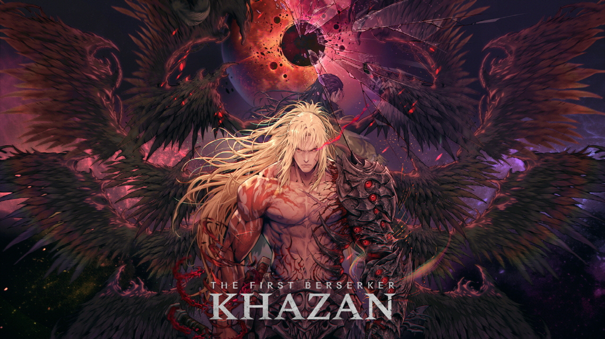

# Tazan Project - 언리얼 C++ 소울라이크 게임 프로토타입

 
## 🎮 프로젝트 개요

'퍼스트 버서커: 카잔' 스타일의 전투 메커니즘을 심도 있게 학습하고 구현하는 것을 목표로 제작된 3인칭 소울라이크 액션 게임 프로토타입입니다. 언리얼 엔진 5 환경에서 C++를 적극적으로 활용하여 객체 지향 설계 원칙에 따라 핵심 시스템을 구축했습니다. 데이터 테이블을 이용한 데이터 주도 설계를 통해 게임 밸런스 및 콘텐츠 확장의 용이성을 확보했으며, 컴포넌트 기반 설계를 통해 캐릭터 기능을 모듈화하여 유지보수성을 높였습니다.

* **장르:** 3인칭 소울라이크 액션
* **개발 기간:** (2025년 2월 ~ 2025년 2월)
* **개발 인원:** (프로그래밍 3)
* **참고 게임:** 퍼스트 버서커: 카잔, 다크 소울 시리즈, 엘든 링

## ✨ 주요 기능 및 특징

* **정교한 소울라이크 전투 시스템:**
	* 실시간, 애니메이션 기반의 공격, 방어, 회피 액션
    * 스태미나 기반 공방 및 자원 관리
    * 강인도(Poise) 시스템 및 다양한 경직(Stagger) 상태 구현
    * 타이밍 기반 가드, 저스트 가드드(Perfect Guard), 회피(Dodge, Perfect Dodge) 메카닉
    * 락온(Lock-On) 및 타겟 전환 기능
    * 데이터 테이블 기반 스킬 시스템 (콤보, 차지 공격 포함)
    * 히트스탑, 넉백 등 타격감 향상 요소 적용
* **AI 시스템:**
    * 몬스터별 커스텀 상태 머신(FSM) 구현
    * 언리얼 Perception System을 이용한 플레이어 감지
    * 스킬 룰렛을 통한 상황별 동적 스킬 선택 로직 (가중치 기반)
	* 상황에 따른 행동 변화 (추격, 공격, 스킬 사용, 복귀, 그로기 등)
    * 보스 몬스터의 다중 페이즈 및 스킬 룰렛 시스템
	* 일반 몬스터(검 해골, 검 든 적, 할버드 맨) 및 복잡한 패턴의 보스 몬스터('Yetuga') 구현
    * 보스 몬스터(예투가)의 특수 패턴 및 페이즈 구현 (돌 던지기, 차지 공격, 콤보 연계)
* **캐릭터 시스템:**
    * `AAreaObject` 기반의 공통 캐릭터 클래스 구조
    * 컴포넌트 기반 모듈식 속성 관리 (Health, Stamina, Poise, Condition)
    * 플레이어 상태(`EPlayerState`)에 따른 행동 제약 시스템
* **확장 가능한 스킬 시스템:**
    * 상속 구조를 이용한 유연한 스킬 구현 (데미지, 회복, 버프/디버프, 콤보 등)
    * 애니메이션 노티파이(AnimNotify)를 통한 정교한 스킬 발동 및 효과 적용 타이밍 제어
* **애니메이션 연동:**
    * 애니메이션 블루프린트 및 C++ `AnimInstance` 활용
    * `AnimNotify` 및 `AnimNotifyState`를 통해 애니메이션과 게임플레이 로직(충돌 판정, 이펙트 재생, 상태 변화 등)을 긴밀하게 연동
* **데이터 주도 설계:**
    * 데이터 테이블(`UDataTable`)을 활용한 캐릭터, 스킬, AI 행동 패턴 관리
* **기타:**
    * UMG 기반 UI 시스템 (상태 바, 플로팅 데미지, 락온 마커)
    * 체크포인트 기반 리스폰 시스템
    * 커스텀 유틸리티 컴포넌트 (이동, 회전, 잔상 효과)

## 🛠️ 사용 기술

* **Engine:** Unreal Engine 5.x
* **Language:** C++ (Core Gameplay Logic, Systems)
* **Blueprint:** UI Logic, Animation Blueprint State Machine, Simple Event Handling
* **Key Systems:** Enhanced Input, Animation Montage & Notify, UMG, Data Tables, Custom FSM, Custom Skill System

## 📂 프로젝트 구조
```
Tazan/
├── Animation/      # 애니메이션 관련 클래스 (AnimInstance, Notifies)
│   ├── Common/
│   ├── Monster/
│   └── Player/
├── AreaObject/     # 게임 월드 내 액터 관련 클래스
│   ├── AI/         # 몬스터 AI (FSM, States)
│   ├── Attribute/  # 캐릭터 속성 컴포넌트 (Health, Stamina, Poise 등)
│   ├── Base/       # 기본 AreaObject 클래스
│   ├── Monster/    # 몬스터 관련 클래스 (Base, Variants, AI Controller)
│   ├── Player/     # 플레이어 관련 클래스 (Character, Controller, State, LockOn)
│   ├── Skill/      # 스킬 관련 클래스 (Base, Specific Skills)
│   └── Utility/    # 보조 유틸리티 액터/컴포넌트 (GhostTrail, MoveUtil)
├── Contents/       # 게임 프레임워크 클래스 (GameInstance, GameMode, GameState)
├── Items/          # 아이템 관련 클래스 (BaseItem)
├── ResourceManager/ # 게임 데이터/타입 정의 (KazanGameType)
├── UI/             # UI 관련 클래스 (Widgets, FloatingDamage)
└── Utilities/      # 공용 유틸리티 (LogMacro, TazanUtility)
```

## ⚙️ 설치 및 실행 방법

1.  **요구 사양:**
    * Unreal Engine 5.5 버전 설치
    * Visual Studio (버전) 와 C++ 개발 도구 설치
2.  **빌드:**
    * 프로젝트 루트 폴더의 `Tazan.uproject` 파일을 우클릭하여 "Generate Visual Studio project files" 실행
    * 생성된 `.sln` 파일을 Visual Studio로 열기
    * 솔루션 탐색기에서 'Tazan' 프로젝트를 우클릭하여 '빌드' 실행
3.  **실행:**
    * Unreal Editor에서 `Tazan.uproject` 파일 열기
    * (필요시) 콘텐츠 브라우저에서 메인 레벨(`Content/Maps/StartMap`) 열기
    * 에디터 상단의 'Play' 버튼 클릭하여 실행

## ⌨️ 주요 조작키 (예시)

* **이동:** W, A, S, D
* **카메라:** 마우스 이동
* **약공격:** 마우스 왼쪽 버튼
* **강공격 (차지 가능):** 마우스 오른쪽 버튼 (누르고 있기)
* **가드/패리:** Ctrl
* **회피:** Space Bar
* **락온 토글:** 마우스 휠 버튼 클릭
* **락온 타겟 전환:** 마우스 휠 스크롤
* **HP 회복:** 1
* **(사망 시) 부활:** esc

## ✨ 구현 상세 및 학습 내용

* **컴포넌트 기반 설계:** 캐릭터의 핵심 속성(HP, SP, Poise, Condition)과 부가 기능(LockOn, Movement, Rotation)을 `UActorComponent`로 분리하여 코드 재사용성과 유지보수성을 높였습니다. 각 컴포넌트는 독립적인 기능을 수행하며, 소유 액터(`AAreaObject`)를 통해 상호작용하거나 델리게이트를 통해 상태 변화를 알립니다.
* **커스텀 AI FSM:** 언리얼 엔진의 Behavior Tree 대신 C++ 기반의 상태 머신을 직접 구현하여 AI 로직을 보다 명확하고 직접적으로 제어했습니다. `UBaseAiState`의 `Enter`, `Execute`, `Exit` 구조를 통해 상태별 행동을 명확히 분리하고, `UBaseAiFSM`에서 상태 전환을 관리합니다.
* **데이터 기반 스킬 시스템:** 스킬 데이터를 `UDataTable`로 관리하여 코드 변경 없이 스킬 밸런스 조정 및 신규 스킬 추가가 용이하도록 설계했습니다. 스킬 클래스(`UBaseSkill` 파생 클래스)는 이 데이터를 기반으로 초기화되며, 애니메이션 몽타주 및 노티파이와 연동되어 실행됩니다.
* **애니메이션 연동:** `AnimNotify`와 `AnimNotifyState`를 적극적으로 활용하여 애니메이션 재생 중 특정 시점에 충돌 판정 활성화/비활성화, 스킬 효과 발동, 상태 변경 등의 게임플레이 로직을 정교하게 트리거했습니다.
* **소울라이크 핵심 메카닉:** 스태미나 관리, 강인도 및 스태거, 패리/회피 타이밍, 락온 등 소울라이크 장르의 특징적인 시스템들을 C++ 코드로 직접 구현하며 해당 장르 게임플레이에 대한 이해도를 높였습니다.

## 💡 개발 중 겪었던 어려움 및 해결 과정

*  **빠른 공격 시 충돌 판정 누락:** `EnableCollisionNotifyState`의 `Tick` 함수만으로는 빠른 애니메이션 재생 속도를 따라가지 못해 충돌 판정이 누락되는 경우가 발생했습니다. 이를 해결하기 위해 `FHitBoxData`에 보간(`bUseInterpolation`, `InterpolationSteps`) 옵션을 추가하고, `UCollisionSkill::ProcessHitDetection`에서 이전 프레임 위치와 현재 프레임 위치 사이를 여러 단계로 나누어 Sweep 검사를 수행하도록 개선하여 판정 정확도를 높였습니다.
*  **복잡한 AI 상태 관리:** 다양한 전투 상황에 따른 몬스터의 행동 패턴을 구현하면서 상태 전이 로직이 복잡해지는 문제가 있었습니다. `UBaseSkillRoulette` 컴포넌트를 도입하여 상황별 스킬 선택 로직을 분리하고, 각 상태 클래스(`UBaseAiState`)의 역할을 명확히 정의하여 FSM 구조를 단순화했습니다.

## 🚀 향후 개선 방향

* 오브젝트 풀링 적용 (플로팅 데미지 액터, 투사체 등)
* 코드 리팩토링 (매직 넘버 상수화, 하드코딩된 경로 제거, 클래스 간 결합도 완화)
* 더 다양한 몬스터 종류 및 보스 패턴 추가
* 아이템 및 장비 시스템 구현
* UI/UX 개선

## 👥 팀원 및 역할

* **김희연:** Base Class 구현, 플레이어, 게임 시스템, Sword Skeleton, HalberdMan 구현
* **이충헌:** 예투가 구현
* **최연택:** 맵 구현

---